# Post-contenido Unidad 7: Patrones Arquitectónicos I

Nicolás Andrés Sánchez Villamizar · Patrones de Diseño de Software · UDES

## Descripción

Repositorio del post-contenido de la Unidad 7. Es un solo proyecto Spring Boot (`multas-biblioteca-api`) para gestionar las multas de la biblioteca de la universidad: cuando un estudiante devuelve un libro tarde se registra una multa, el sistema calcula el monto y después la multa se paga. El trabajo tiene dos partes:

- Parte 1: API REST en arquitectura en capas (Model, Repository, Service, Controller) con Spring Data JPA sobre H2.
- Parte 2: pago en línea con dos pasarelas intercambiables (PagosUDES y Wompi). Aquí elegí introducir un puerto de dominio con dos adaptadores, solo en la porción de pago.

## Estructura final de paquetes

```
sanchez-post1-u7-patrones/
├── README.md
├── docs/capturas/                       Evidencias de los endpoints probados
└── multas-biblioteca-api/
    ├── pom.xml
    ├── simulador/SimuladorPasarelas.java   Pasarelas falsas para pruebas locales (fuera del build)
    └── src/main/
        ├── resources/application.properties
        └── java/com/example/multas/
            ├── MultasApplication.java
            ├── controller/              Presentación (Parte 1, se agrega /pagar-en-linea en la Parte 2)
            │   ├── MultaController.java
            │   ├── GenerarMultaRequest.java
            │   └── GlobalExceptionHandler.java
            ├── service/                 Aplicación
            │   └── MultaService.java
            ├── model/                   Dominio de la Parte 1 (entidad JPA y excepciones)
            │   ├── Multa.java
            │   ├── EstadoMulta.java
            │   └── MultaNotFoundException, LimiteMultasPendientesException, MultaYaPagadaException
            ├── repository/              Infraestructura de persistencia
            │   └── MultaRepository.java
            ├── domain/                  Parte 2: puerto y tipos de dominio, Java puro sin Spring
            │   ├── port/PasarelaPagoPort.java
            │   ├── SolicitudPago.java
            │   ├── ResultadoPago.java
            │   └── PagoRechazadoException.java
            └── infrastructure/          Parte 2: adaptadores, aquí sí hay Spring y HTTP
                ├── pago/PagosUdesAdapter.java
                ├── pago/WompiAdapter.java
                └── config/RestTemplateConfig.java
```

Dirección de las dependencias:

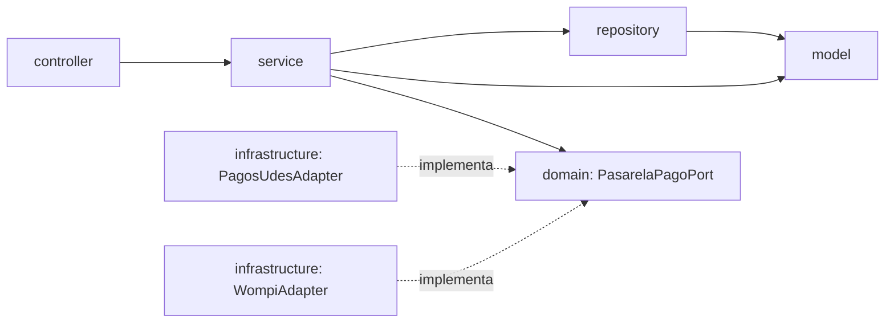

Nada apunta desde `domain/` hacia afuera, y `service/` no conoce ninguna clase de `infrastructure/`.

## Parte 1: Arquitectura en capas

El controlador solo habla con `MultaService` y nunca toca el repositorio. El servicio no sabe nada de HTTP, solo orquesta el repositorio y aplica las reglas. Las dos reglas de negocio no triviales quedaron repartidas así:

- El monto (500 por día de atraso, con tope de 15000) se calcula en la entidad con [`Multa.calcularMonto`](https://github.com/NicolasSnchz/sanchez-post1-u7-patrones/blob/main/multas-biblioteca-api/src/main/java/com/example/multas/model/Multa.java#L53).
- El tope de 3 multas pendientes por estudiante lo decide [`MultaService.generar`](https://github.com/NicolasSnchz/sanchez-post1-u7-patrones/blob/main/multas-biblioteca-api/src/main/java/com/example/multas/service/MultaService.java#L45) con la consulta [`countByEstudianteIdAndEstado`](https://github.com/NicolasSnchz/sanchez-post1-u7-patrones/blob/main/multas-biblioteca-api/src/main/java/com/example/multas/repository/MultaRepository.java#L15).

Además, la regla de "no se paga dos veces" vive en [`Multa.marcarComoPagada`](https://github.com/NicolasSnchz/sanchez-post1-u7-patrones/blob/main/multas-biblioteca-api/src/main/java/com/example/multas/model/Multa.java#L58), así que el servicio no es un simple passthrough del repositorio.

| Método | Ruta | Respuesta |
|---|---|---|
| GET | `/api/multas` | 200 con la lista |
| GET | `/api/multas/{id}` | 200, o 404 si no existe |
| GET | `/api/multas/estudiante/{estudianteId}` | 200 con las multas del estudiante |
| POST | `/api/multas` | 201, 400 si los datos son inválidos, 409 si supera el tope de pendientes |
| PATCH | `/api/multas/{id}/pagar` | 200 (pago en ventanilla), 409 si ya estaba pagada |
| POST | `/api/multas/{id}/pagar-en-linea` | 200, 402 si la pasarela rechaza, 409 si ya estaba pagada, 404 si no existe |

## Parte 2: Pago en línea con dos pasarelas

Elegí la opción C: un puerto de dominio [`PasarelaPagoPort`](https://github.com/NicolasSnchz/sanchez-post1-u7-patrones/blob/main/multas-biblioteca-api/src/main/java/com/example/multas/domain/port/PasarelaPagoPort.java#L7) en `domain/`, sin ninguna dependencia de Spring, y dos adaptadores en `infrastructure/pago/` que traducen el contrato HTTP de cada pasarela al mismo [`ResultadoPago`](https://github.com/NicolasSnchz/sanchez-post1-u7-patrones/blob/main/multas-biblioteca-api/src/main/java/com/example/multas/domain/ResultadoPago.java#L4). El hexagonal se aplicó solo a esta porción; `Multa`, `MultaRepository` y `MultaController` siguen en capas, porque migrar todo sería sobre-ingeniería para este alcance.

La razón principal es que el requisito calza con el criterio de la sección 7.3 de la guía: cada pasarela es una fuente externa con su propio formato (PagosUDES responde `idTransaccion`/`estadoTransaccion` en pesos, Wompi trabaja en centavos y responde `reference`/`status`), y la Vicerrectoría ya avisó que al terminar el piloto se puede agregar o quitar una pasarela. Con el puerto, ese cambio es agregar o borrar una clase en `infrastructure/pago/` sin tocar `MultaService`.

El servicio usa el puerto en [`MultaService.pagarConPasarela`](https://github.com/NicolasSnchz/sanchez-post1-u7-patrones/blob/main/multas-biblioteca-api/src/main/java/com/example/multas/service/MultaService.java#L69): primero valida que la multa no esté pagada (409), luego llama a la pasarela activa y, si el resultado no es exitoso, lanza `PagoRechazadoException`, que el [`GlobalExceptionHandler`](https://github.com/NicolasSnchz/sanchez-post1-u7-patrones/blob/main/multas-biblioteca-api/src/main/java/com/example/multas/controller/GlobalExceptionHandler.java#L42) convierte en 402 Payment Required.

## Correcciones al enunciado

Revisé el enunciado contra sus checkpoints y la rúbrica y encontré estas inconsistencias. Las corregí así:

1. **El puerto recibía `Multa` y eso rompe un checkpoint.** El paso 9 define `procesar(Multa multa)`, pero el checkpoint pide que `PasarelaPagoPort` compile solo con `java.*`. Eso es imposible porque `Multa` es una entidad JPA que importa `jakarta.persistence` y `jakarta.validation`. Agregué el record [`SolicitudPago`](https://github.com/NicolasSnchz/sanchez-post1-u7-patrones/blob/main/multas-biblioteca-api/src/main/java/com/example/multas/domain/SolicitudPago.java#L7) (id de la multa, estudiante y monto) y el puerto recibe eso. El servicio arma la solicitud en [la línea 74](https://github.com/NicolasSnchz/sanchez-post1-u7-patrones/blob/main/multas-biblioteca-api/src/main/java/com/example/multas/service/MultaService.java#L74). La captura `p2-01` muestra que `domain/` compila con el JDK solo, sin ninguna librería.
2. **`GenerarMultaRequest` estaba en el mismo archivo que el controlador.** Java no permite dos tipos públicos en un archivo, así que lo pasé a [`GenerarMultaRequest.java`](https://github.com/NicolasSnchz/sanchez-post1-u7-patrones/blob/main/multas-biblioteca-api/src/main/java/com/example/multas/controller/GenerarMultaRequest.java). También le puse mensajes en español a sus validaciones, igual que en la entidad, porque sin ellos el 400 devolvía el mensaje genérico del validador.
3. **Los commits de la Parte 1 dejaban por fuera archivos necesarios.** El paso 7 no agrega `MultasApplication.java` ni `application.properties` en ningún commit (el properties aparecía recién en la Parte 2), así que la Parte 1 subida a GitHub no arrancaba. Los incluí en el primer commit junto con el `.gitignore`.
4. **El paso 9 dice que `controller/` queda "sin cambios",** pero el paso 12 le agrega el endpoint `/pagar-en-linea` y el manejador del 402. Seguí el paso 12 porque es el que pide el checkpoint.
5. **El checkpoint pide probar un rechazo de una pasarela "simulada", pero la guía no trae ninguna.** Agregué [`simulador/SimuladorPasarelas.java`](https://github.com/NicolasSnchz/sanchez-post1-u7-patrones/blob/main/multas-biblioteca-api/simulador/SimuladorPasarelas.java), que levanta PagosUDES en el puerto 9001 y Wompi en el 9002 con los mismos contratos y URLs del `application.properties`. Aprueba pagos de hasta 10000 pesos y rechaza los mayores. Está fuera de `src/`, así que no entra en el build de Maven.

## Cómo ejecutar

Requisitos: JDK 17 o superior y Maven 3.8+.

```
cd multas-biblioteca-api
mvn clean package
mvn spring-boot:run
```

La API queda en `http://localhost:8080/api/multas` y la consola H2 en `http://localhost:8080/h2-console` (JDBC URL `jdbc:h2:mem:multas_biblioteca_db`, usuario `sa`, sin contraseña).

Para probar el pago en línea, en otra terminal dentro de `multas-biblioteca-api`:

```
java simulador/SimuladorPasarelas.java
```

Para cambiar de pasarela se edita `app.pagos.proveedor=wompi` en [`application.properties`](https://github.com/NicolasSnchz/sanchez-post1-u7-patrones/blob/main/multas-biblioteca-api/src/main/resources/application.properties#L18) y se reinicia, o sin editar nada:

```
mvn spring-boot:run -Dspring-boot.run.arguments=--app.pagos.proveedor=wompi
```

En ningún caso se modifica `MultaController` ni `MultaService`.

## Herramientas utilizadas

- Java 17 (`release 17`), Spring Boot 3.5, Spring Web, Spring Data JPA, Bean Validation, H2, RestTemplate
- Apache Maven, curl, Git y GitHub

## Decisiones de diseño

### Punto de decisión 1: cálculo del monto, ¿entidad o Service?

El criterio que usé es simple: si una regla no necesita ningún colaborador externo (repositorio, otro servicio, configuración), va en el objeto de dominio; si necesita datos que la entidad no tiene, va en el servicio. El monto solo depende de los días de atraso, así que vive en [`Multa.calcularMonto`](https://github.com/NicolasSnchz/sanchez-post1-u7-patrones/blob/main/multas-biblioteca-api/src/main/java/com/example/multas/model/Multa.java#L53) y el servicio solo lo invoca en [la línea 59](https://github.com/NicolasSnchz/sanchez-post1-u7-patrones/blob/main/multas-biblioteca-api/src/main/java/com/example/multas/service/MultaService.java#L59).

Si lo hubiera dejado como método privado de `MultaService`, la entidad quedaría como un contenedor de getters y setters (modelo anémico). Cualquier otra parte que necesitara recalcular un monto, por ejemplo un reporte o un ajuste de tarifa, tendría que copiar la fórmula o pasar por un servicio transaccional para algo que no toca la base de datos. Además, al ser estático y puro, se puede probar con una sola línea sin levantar Spring. Con el mismo criterio dejé `marcarComoPagada` en la entidad: proteger su propio estado es responsabilidad de la `Multa`.

### Punto de decisión 2: conteo de pendientes, ¿consulta o filtrado en memoria?

Contar las pendientes sí necesita datos que solo tiene la base de datos. La decisión de negocio ("¿se le puede generar otra multa?") la toma [`MultaService.generar`](https://github.com/NicolasSnchz/sanchez-post1-u7-patrones/blob/main/multas-biblioteca-api/src/main/java/com/example/multas/service/MultaService.java#L47), pero el dato lo resuelve [`countByEstudianteIdAndEstado`](https://github.com/NicolasSnchz/sanchez-post1-u7-patrones/blob/main/multas-biblioteca-api/src/main/java/com/example/multas/repository/MultaRepository.java#L15), que Spring Data traduce a un `SELECT COUNT(*) ... WHERE estudiante_id = ? AND estado = ?`. Viaja un solo número por la red.

La alternativa de traer todo con `findByEstudianteId` y filtrar con streams funciona igual con 3 multas de prueba, pero con miles de multas por estudiante cada creación cargaría y mapearía a objetos todo el historial del estudiante solo para contar. El tiempo de respuesta y la memoria crecerían en proporción a ese historial, y además se estarían cargando multas ya pagadas que no importan para la regla. Si la tabla creciera mucho, la consulta de conteo se puede apoyar en un índice por `(estudiante_id, estado)` sin cambiar una línea del servicio.

### Punto de decisión 3: selección del adaptador activo

Usé `@ConditionalOnProperty` en cada adaptador ([PagosUDES](https://github.com/NicolasSnchz/sanchez-post1-u7-patrones/blob/main/multas-biblioteca-api/src/main/java/com/example/multas/infrastructure/pago/PagosUdesAdapter.java#L15), [Wompi](https://github.com/NicolasSnchz/sanchez-post1-u7-patrones/blob/main/multas-biblioteca-api/src/main/java/com/example/multas/infrastructure/pago/WompiAdapter.java#L15)). Al arrancar, Spring crea solo el bean que coincide con `app.pagos.proveedor`, y por eso [`MultaService`](https://github.com/NicolasSnchz/sanchez-post1-u7-patrones/blob/main/multas-biblioteca-api/src/main/java/com/example/multas/service/MultaService.java#L25) recibe un único `PasarelaPagoPort` por constructor, sin `@Qualifier` ni ningún `if`.

La alternativa era inyectar un `Map<String, PasarelaPagoPort>` y elegir la clave en tiempo de ejecución. Da más flexibilidad, porque se podría cambiar de pasarela sin reiniciar o incluso usar las dos a la vez, pero la descarté por dos razones. Primero, el requisito real es una pasarela fija por sede durante el piloto, así que esa flexibilidad no se usaría. Segundo, `MultaService` tendría que conocer las claves de cada proveedor y la propiedad de configuración, que es justo el tipo de detalle que el puerto busca sacar del servicio. Un efecto bueno de la opción elegida: `PagosUdesAdapter` tiene `matchIfMissing = true`, así que sin la propiedad se usa la institucional, y si alguien escribe un valor que no existe (por ejemplo `nequi`) la aplicación falla al arrancar porque no hay ningún `PasarelaPagoPort`, en vez de fallar cuando un estudiante intenta pagar.

### Punto de decisión 4: diseño del puerto y del tipo de resultado

Los dos adaptadores reciben y devuelven formatos distintos, pero ambos terminan en el mismo `ResultadoPago(proveedor, exitoso, referenciaExterna, mensaje)`. PagosUDES pone su `idTransaccion` en `referenciaExterna`, y Wompi pone su `reference` y además convierte el monto a centavos dentro del adaptador ([línea 30](https://github.com/NicolasSnchz/sanchez-post1-u7-patrones/blob/main/multas-biblioteca-api/src/main/java/com/example/multas/infrastructure/pago/WompiAdapter.java#L30)). Los errores de red tampoco salen del adaptador: el `catch (RestClientException)` los traduce a un resultado no exitoso ([PagosUDES, línea 36](https://github.com/NicolasSnchz/sanchez-post1-u7-patrones/blob/main/multas-biblioteca-api/src/main/java/com/example/multas/infrastructure/pago/PagosUdesAdapter.java#L36)), así que el servicio nunca ve una excepción de Spring.

Si el puerto devolviera el DTO propio de cada pasarela, o tuviera un método por proveedor, `MultaService` tendría que preguntar con `instanceof` o con un `switch` qué formato le llegó, y una tercera pasarela obligaría a modificar el servicio además de crear el adaptador. Y si `ResultadoPago` tuviera un campo llamado `idTransaccion`, `WompiAdapter` tendría que meter su `reference` en un campo con el nombre del contrato de PagosUDES, o dejarlo vacío. Eso sería la señal de que el tipo de dominio está acoplado a un proveedor concreto en vez de describir lo que el negocio necesita saber: si se pagó, quién lo procesó y con qué referencia se puede rastrear.

### Trade-off considerado: Parte 2

La opción que más pesé contra la C fue la B (interfaz Strategy dentro de `service/`). Las dos resuelven la intercambiabilidad y en ambas el servicio depende de una interfaz, así que la diferencia es más de dónde vive cada cosa que de funcionamiento.

A favor de la C:

- El contrato vive en `domain/` y es Java puro, así que se puede compilar y probar sin Spring (captura `p2-01`). Con la B, la interfaz y sus implementaciones con `RestTemplate` y DTOs en centavos quedarían en `service/`, mezclando la capa de aplicación con detalles de infraestructura HTTP.
- Agregar o quitar una pasarela es crear o borrar una clase en `infrastructure/pago/`. No se toca `domain/` ni `service/`, y eso es exactamente lo que la Vicerrectoría anticipa para después del piloto.
- `MultaService` se puede probar con un puerto falso escrito en una lambda, sin mocks de HTTP.

En contra de la B, el argumento concreto es que la capa de servicio terminaría dependiendo de clases que conocen URLs, formatos JSON y centavos de proveedores externos, que en arquitectura en capas pertenecen a infraestructura. La A la descarté desde el principio porque pone los dos clientes HTTP dentro de `MultaService` y cada pasarela nueva obliga a modificarlo.

Lo que costó la C: dos paquetes nuevos (`domain/` e `infrastructure/`), 7 archivos nuevos y unas 185 líneas entre lo nuevo y lo modificado, más el record `SolicitudPago` que tuve que agregar para que el puerto no dependa de la entidad JPA. También queda algo confuso tener `model/` y `domain/` al mismo tiempo, porque `Multa` sigue siendo una entidad JPA en `model/`. Es decir, el hexagonal es real solo en el pago. Si el piloto terminara y quedara una sola pasarela, no revertiría el puerto, porque el costo ya está pagado y quitar un adaptador es borrar un archivo. Lo que sí no haría es extender este estilo al resto del proyecto mientras no aparezca otra integración externa que lo justifique.

## Capturas

Todas las pruebas se hicieron con curl contra la aplicación corriendo. El `-w` muestra el código HTTP de cada respuesta.

**Parte 1**

GET al iniciar, lista vacía (200):

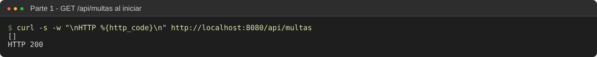

POST válido (201). La segunda multa tiene 40 días y el monto queda en el tope de 15000:

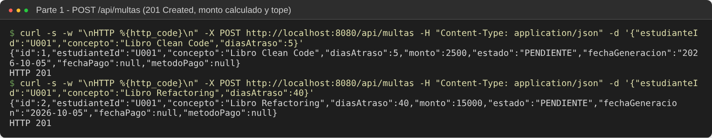

POST sin `estudianteId` y con 0 días (400 con los mensajes de validación):

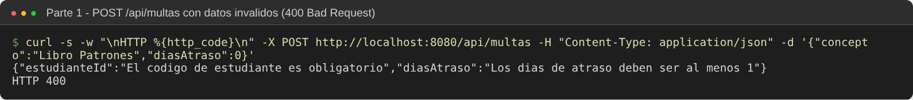

Tercera multa pendiente aceptada y la cuarta rechazada (409):

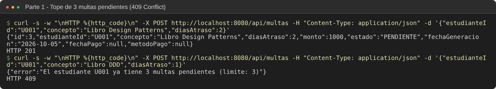

ID inexistente (404):

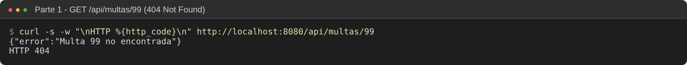

Pago en ventanilla (200 con `metodoPago` VENTANILLA) y el segundo intento (409):

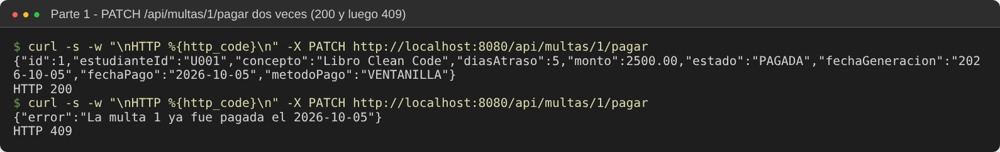

Consulta por estudiante desde el navegador:

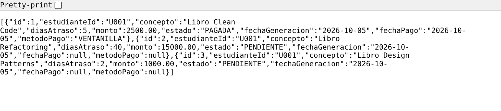

**Parte 2**

`domain/` no importa Spring y compila solo con el JDK:

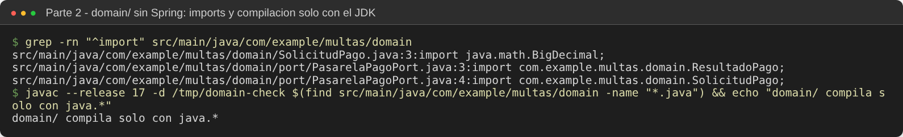

Con `app.pagos.proveedor=pagosudes`: pago aprobado, `metodoPago` PAGOSUDES, y el log del simulador muestra el formato que recibió PagosUDES:

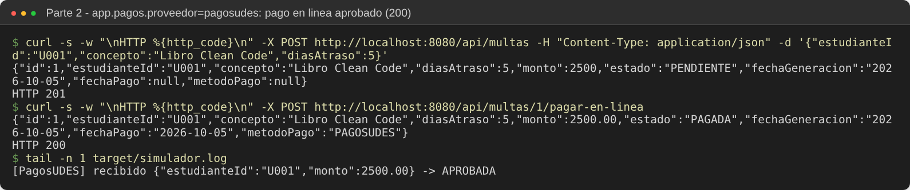

PagosUDES rechaza una transacción de 15000 (402):

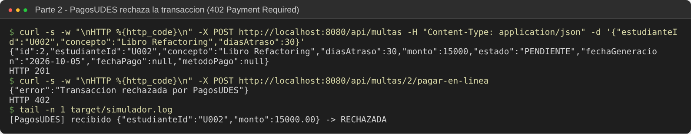

Multa ya pagada, en línea y por ventanilla (409 en ambos):

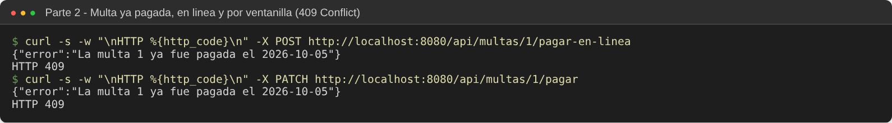

Mismo código, solo cambiando a `app.pagos.proveedor=wompi`: el mismo endpoint ahora usa `WompiAdapter`, que envía `reference` y el monto en centavos:

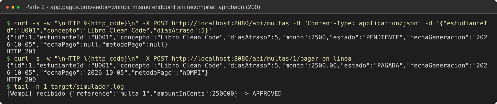

Wompi rechaza el pago (402):

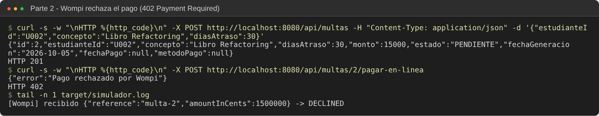

Con el simulador apagado, el adaptador captura el error de red y el cliente recibe 402 con el motivo:

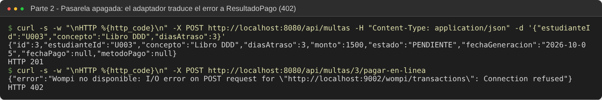

Listado final desde el navegador:

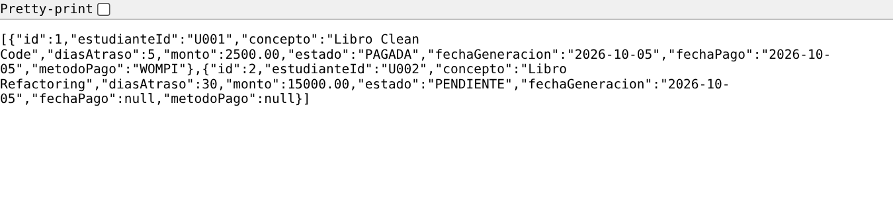

## Conclusiones

En la Parte 1 lo que más me sirvió fue tener un criterio claro para ubicar cada regla: lo que solo depende de la propia multa va en la entidad y lo que necesita datos va en el servicio, resolviendo el dato donde es más barato, que en este caso es la base de datos. En la Parte 2 lo difícil no fue escribir el código del puerto, sino decidir si valía la pena, porque la opción B también funcionaba y era más corta. Lo que inclinó la balanza fue que las pasarelas tienen contratos realmente distintos y que el número de proveedores va a cambiar, que es justo cuando la guía recomienda hexagonal. También me quedó claro que aplicar el patrón a medias tiene un costo, porque conviven `model/` y `domain/`, y que hay que aplicarlo solo donde hay una integración externa que lo justifique y no en todo el proyecto.
